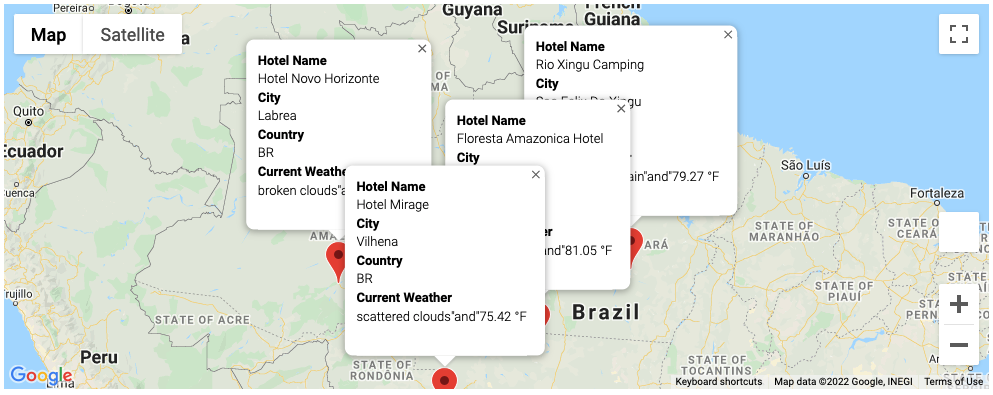

# World_Weather_Analysis

## Project Overview
PlanMyTrip is a top travel technology company that specializes in internet related services in the hotel and lodging industry. The company's user interface team is working on a new Python-based PlanMyTrip app which present data for customers via the search page, which they will then filter based on their preferred travel criteria in order to find their ideal hotel in the world.

For this project, we are enhancing the PlanMyTrip app to the next level. Specificatlly, we will be adding the weather description to the weather data. Then we'll have the beta testers use input statements to filter the data for their weather preferences which will be used to identify potential travel destinations and nearby hotels. From the list of potential travel destinations, the beta testers will choose four cities to create a travel itinerary. Finally, we will apply the Google Maps Directions API to create a travel route between the four cities as well as a marker layer map.

Overall, there are three technical analysis for this project:
- Deliverable 1: Retrieve Weather Data
- Deliverable 2: Create a Customer Travel Destinations Map
- Deliverable 3: Create a Travel Itinerary Map

## Analysis

### Deliverable 1: Retrieve Weather Data

Key technical steps:
- Create a new Jupyter Notebook file to retrieve the weather data, and name it Weather_Database.ipynb.
- Create a new set of 2,000 random latitudes and longitudes.
- Get the nearest city using the citipy module.
- Perform an API call with the OpenWeatherMap.
- Retrieve the following information from the API call:
    - Latitude and longitude
    - Maximum temperature
    - Percent humidity
    - Percent cloudiness
    - Wind speed
    - Weather description (for example, clouds, fog, light rain, clear sky)
- Add the data to a new DataFrame and save to a csv file

We succesfully retrieved information on 697 cities based on the search. A screen shot of the DataFrame is shown below. 
A full list of the weather data is uploaded as "WeatherPy_Database.csv" in the "Weather_Database" folder.

### Deliverable 2: Create a Customer Travel Destinations Map

Key technical steps:
- Import the WeatherPy_Database.csv file to Jupyter Notebook as DataFrame
- Write two input statements that prompt the user to enter their minimum and maximum temperature criteria for their vacation.
- Use the loc method to filter the DataFrame for temperature criteria collected from input, then create a new DataFrame.
- Perform an API call on Google Maps API (nearby search) to retrieve the latitude and longitude of each city to find the nearest hotel based on specific search parameters. If a hotel isn't found, skip to the next city.
- Organize the data into a new DataFrame and save to a csv file
- Use jupyter-gamps plugin to add a layer of markers for each city to the map 

We successfully retrieved 178 cities and their nearest hotel names. A screen shot of the DataFrame is shown below.
A full list of the vacation search data is uploaded as "WeatherPy_vacation.csv" in the "Vacation_Search" folder.

The marker layer map has a pop-up marker for each city. The pop-up marker for the cities are shown as below (showing 3 cities as example):

### Deliverable 3: Create a Travel Itinerary Map

Key technical steps:
- Import the WeatherPy_vacation.csv file to Jupyter Notebook as DataFrame
- create a marker layer map of the vacation search results.
- From the vacation search map, choose four cities that a customer might want to visit. 
- use Pandas.loc method to create separate DataFrames for each city on the travel route.
- use the to_numpy() function and list indexing to write code to retrieve the latitude-longitude pairs as tuples from each city DataFrame.
- use the Google Maps Directions documentation to create a directions layer map, where the starting and ending city are the same city, the waypoints are the three other cities, and the travel_mode is either "DRIVING", "BICYCLING", or "WALKING".
- use the concat() function code snippet to combine the four separate city DataFrames into one DataFrame.
- create a new marker layer map of the cities on the travel route.

Below is the itinerary map. 
First image shows the route between the four chosen travel cities :

Second image shows the pop-up markers for the four travel cities:

